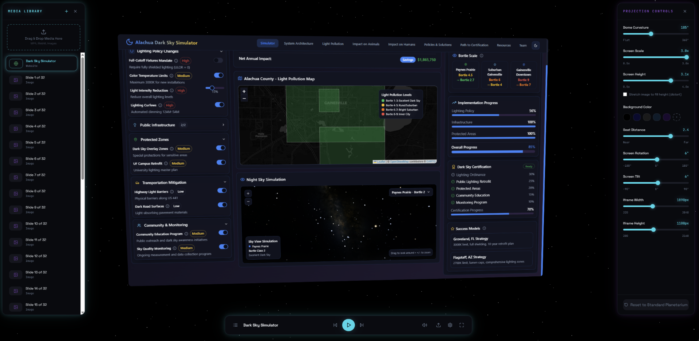
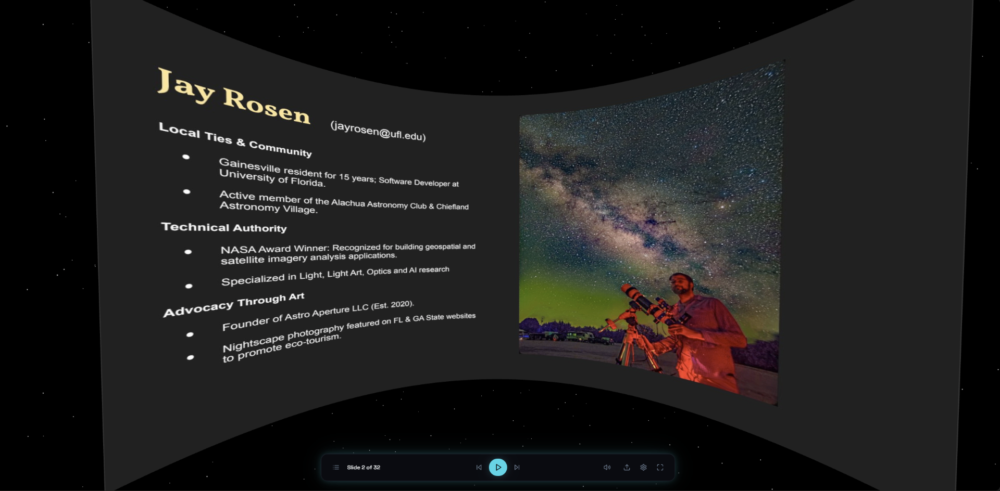
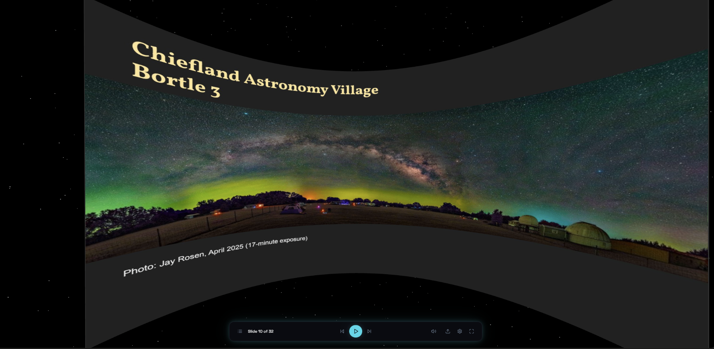
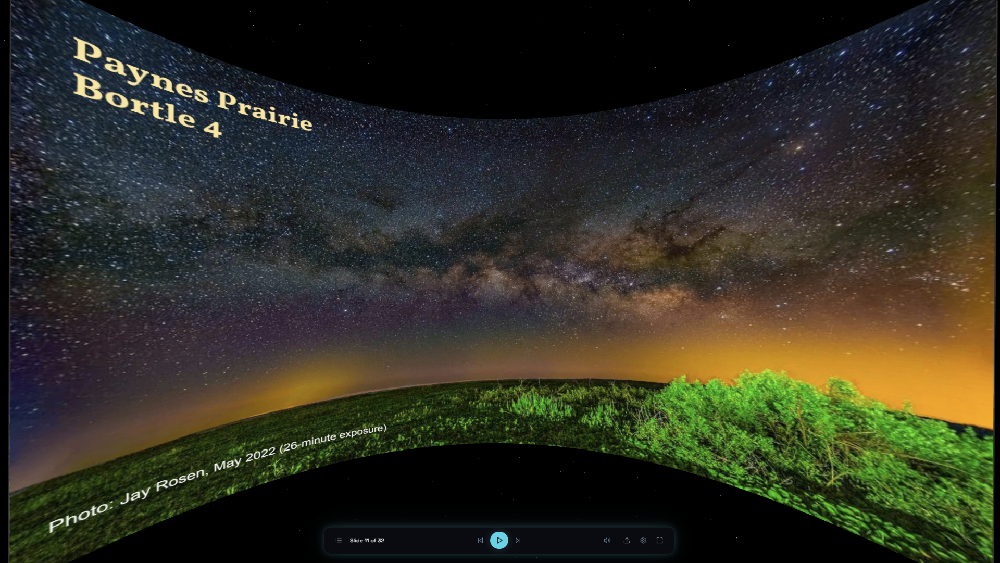
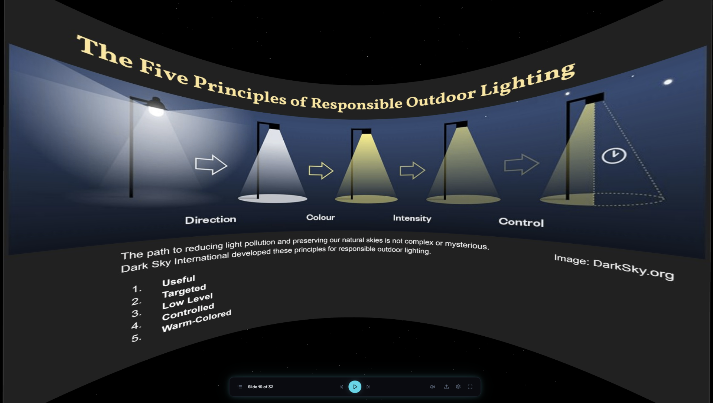
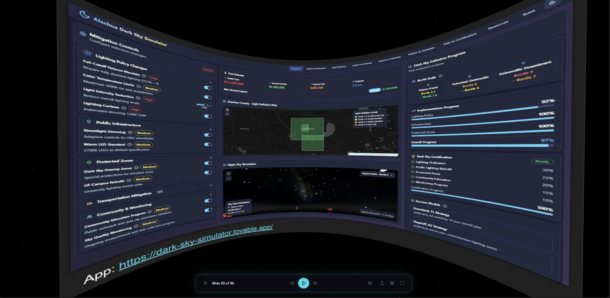
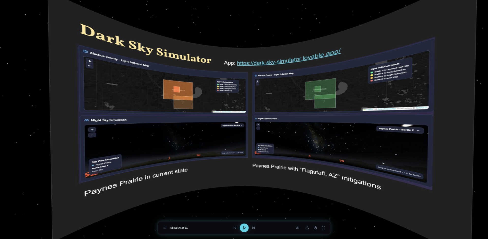
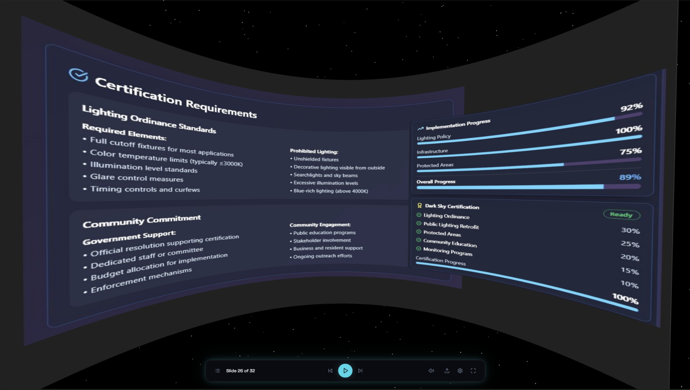

# 🌌 Planetarium Presentation Player

A 3D planetarium-style presentation viewer built with React, Three.js, and Zustand. Designed to prototype an upcoming presentation on **Preserving Natural Skies** and the **Dark Sky Simulator** app.

The player projects slides and interactive websites onto a curved dome surface, simulating a planetarium theater experience in the browser.

## Screenshots

### Full Interface — Media Library, Live Website Embed & Projection Controls


### Presenter Bio


### Chiefland Astronomy Village — Bortle 3 Skies


### Paynes Prairie — Bortle 4 Skies


### The Five Principles of Responsible Outdoor Lighting


### Dark Sky Simulator App — Live Embed


### Before & After Sky Simulation Comparison


### Dark Sky Certification Requirements & Progress


## Features

- **Curved Dome Projection** — Slides and media are displayed on a 3D cylindrical surface with adjustable curvature, size, rotation, and tilt
- **Media Playlist** — Drag-and-drop images and videos into the media library; auto-advances through image slides
- **Live Website Embedding** — Embed interactive websites (like the Dark Sky Simulator) directly onto the dome with adjustable iframe dimensions
- **Projection Controls** — Fine-tune dome curvature, screen scale, height, rotation, tilt, seat distance, and background color
- **Starfield Background** — Ambient animated starfield surrounding the dome for immersion
- **Fullscreen Support** — Present in fullscreen mode for maximum impact

## Tech Stack

- **React 18** + **TypeScript**
- **Three.js** via `@react-three/fiber` and `@react-three/drei`
- **Zustand** for state management
- **Tailwind CSS** + **shadcn/ui**
- **Vite** for bundling

## Getting Started

```sh
# Clone the repository
git clone <YOUR_GIT_URL>

# Navigate to the project directory
cd <YOUR_PROJECT_NAME>

# Install dependencies
npm i

# Start the development server
npm run dev
```

## About the Presentation

This tool was built to support a presentation on **dark sky preservation** in Alachua County, Florida. The talk covers:

- Light pollution impacts on astronomy, wildlife, and human health
- The five principles of responsible outdoor lighting
- The [Dark Sky Simulator](https://dark-sky-simulator.lovable.app/) — an interactive tool for visualizing light pollution mitigation strategies
- Path to Dark Sky Community certification

## License

Built with [Lovable](https://lovable.dev).
